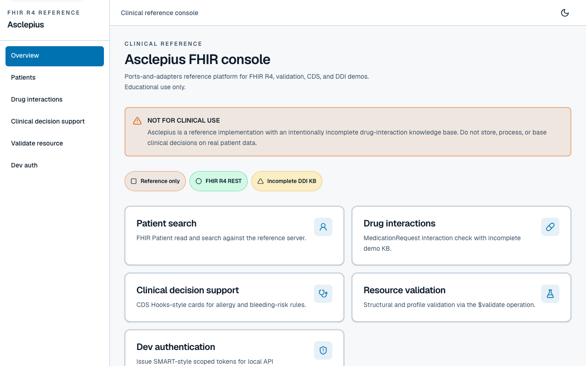
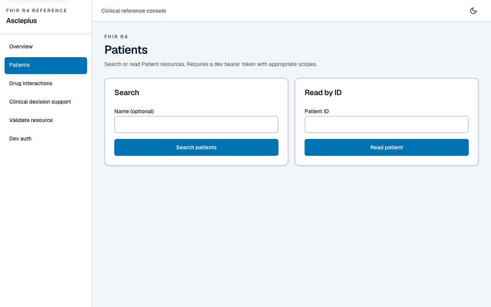
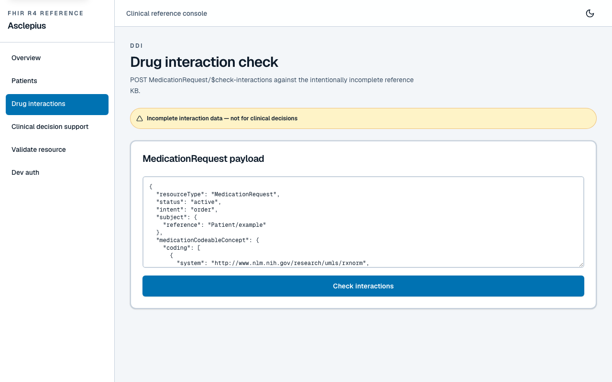
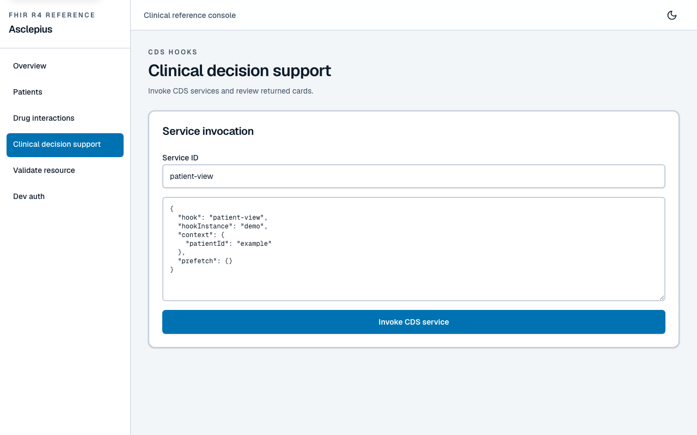
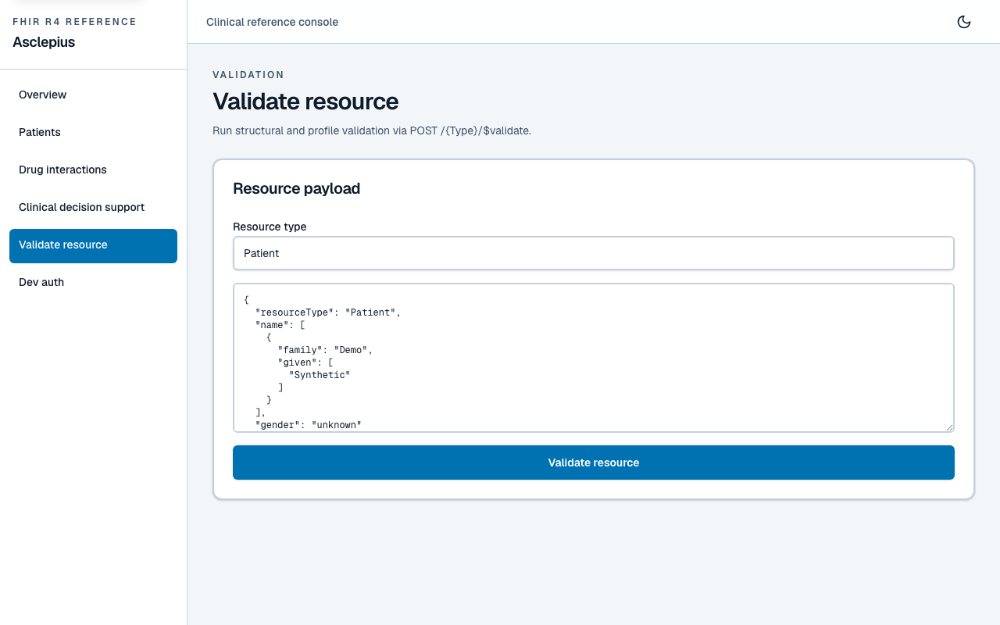

# Asclepius — Typed FHIR R4 teaching kit

[](https://github.com/SafetyMP/Asclepius/actions/workflows/ci.yml)
[](https://github.com/SafetyMP/Asclepius/actions/workflows/codeql.yml)
[](https://scorecard.dev/viewer/?uri=github.com/SafetyMP/Asclepius)
[](LICENSE)
[](#getting-started)

> ⚠️ **NOT FOR CLINICAL USE.** Asclepius is a **typed FHIR R4 teaching kit**,
> not a clinical data platform and **not** a server for PHI. It is
> **not** HIPAA-certified, **not** a regulated medical device, and its
> drug-interaction knowledge base is intentionally **incomplete**. Do **not**
> store, process, or base clinical decisions on real patient data with this
> software. See the [regulatory disclaimer](#regulatory-disclaimer) below.

A from-scratch, layered FHIR R4 subset you can read in one sitting: **zod** as
the source of truth, **ports and adapters**, and DDI that is incomplete by
design. Built to be **correct and testable**, not feature-complete. Every
architectural choice is documented with first-principles reasoning and an
honest "better tool for production" callout in [Architecture Decision Records](docs/adr/).
See [docs/DESIGN-PIVOT.md](docs/DESIGN-PIVOT.md) for why this is a teaching kit.

<p align="center">
  
</p>

## Why not Medplum / HAPI

- **Medplum** is a production TypeScript FHIR platform you operate. This repo is
  architecture you can read in one sitting (zod schemas, ports, tests) — not a
  substitute and not a place for PHI.
- **HAPI FHIR** is the Java FHIR server for real APIs and conformance. Use it
  when you need a production server; use Asclepius when you want hexagonal
  adapters and `z.infer` types without a framework.
- **IBM FHIR** (and similar enterprise servers) persist clinical data at scale.
  Asclepius DDI is incomplete by design and must never store real patient data
  or connect to an EHR.

## Screenshots

Synthetic demo data only — **NOT FOR CLINICAL USE.** No real patient data.

| Overview (synthetic) | Patients (synthetic) | Drug interactions (synthetic) | Clinical decision support (synthetic) |
|:--------------------:|:--------------------:|:-----------------------------:|:-------------------------------------:|
|  |  |  |  |

| Validate resource (synthetic) |
|:-----------------------------:|
|  |

The optional console in [`web/`](web/) explores the local FHIR API. Run
`npm run dev` for the API (port 8787), then `cd web && npm install && npm run dev`
on port **3200**. Regenerate visuals with `cd web && npm run screenshots`; see
[`docs/assets/README.md`](docs/assets/README.md). The next slice shrinks `web/`
clinical chrome; **validate and ports tests are the product**.

_Synthetic demo data only — NOT FOR CLINICAL USE._

## Status

This is a **teaching kit** — core pillars are built and tested; see the
table below for what exists today. Positioning: [docs/DESIGN-PIVOT.md](docs/DESIGN-PIVOT.md).

| Pillar                    | Implementation                                                                                                                                                                                                                                                                | Status                                                            |
| ------------------------- | ----------------------------------------------------------------------------------------------------------------------------------------------------------------------------------------------------------------------------------------------------------------------------- | ----------------------------------------------------------------- |
| FHIR R4 resource model    | Hand-authored zod schemas (single source of truth → inferred TS types); 9 resources, primitives, datatypes, Bundle, OperationOutcome                                                                                                                                          | ✅ Built                                                          |
| Storage                   | `ResourceRepository` **port** + in-memory versioned adapter (immutable snapshots, history, soft delete)                                                                                                                                                                       | ✅ Built                                                          |
| Storage (persistent)      | SQLite adapter via `better-sqlite3` (WAL, JSON columns); selected by `STORAGE=sqlite`                                                                                                                                                                                         | ✅ Built ([ADR 0004](docs/adr/0004-storage-sqlite-and-memory.md)) |
| FHIR search               | Hand-built query-plan **compiler** (param types, modifiers, prefixes) + **executor** (path extraction, per-type matching, reference chaining, `_sort`/`_count`/`_page`)                                                                                                       | ✅ Built                                                          |
| REST API                  | Hono HTTP adapter: create/read/vread/update(+create-on-update)/delete, ETag/Location/versioning, instance + type history Bundles, search (GET ?params + POST _search → searchset Bundle, incl. reference chaining + self/next/prev pagination links), OperationOutcome errors | ✅ Built ([ADR 0005](docs/adr/0005-hono-http.md))                 |
| Validation                | zod structural validation + profile-level rules (Patient identity, Observation code system, MedicationRequest medication[x]); `$validate` operation (`POST /{Type}/$validate`) + create/update gating                                                                         | ✅ Built                                                          |
| Clinical Decision Support | Composable rule DSL (pure functions `PatientContext → CdsCard[]`) + CDS Hooks endpoint (`POST /cds-services/:id`); MVP rules: drug-allergy + warfarin-NSAID bleeding risk                                                                                                     | ✅ Built ([ADR 0007](docs/adr/0007-cds-rule-dsl.md))              |
| Drug–drug interactions    | In-memory knowledge base (6 RxNorm interactions) + bidirectional checker; `POST /MedicationRequest/$check-interactions` endpoint + DDI CDS rule — **incomplete by design**                                                                                                    | ✅ Built                                                          |
| AuthN/AuthZ               | JWT (HS256, jose) + SMART-style scope middleware (`system/Patient.read`, `user/*.write`); dev-only `/auth/token` issuer (prod-disabled). Patient-compartment filtering + role-based overrides deferred                                                                        | ✅ Built ([ADR 0008](docs/adr/0008-jwt-and-smart-scopes.md))      |
| Audit                     | Hash-chained, append-only, tamper-evident log (SHA-256 chain; in-memory + SQLite adapters; every request recorded via middleware)                                                                                                                                             | ✅ Built ([ADR 0009](docs/adr/0009-hash-chained-audit.md))        |
| Web console               | Next.js local UI in [`web/`](web/) — teaching surface only (BFF → FHIR API). Next slice: shrink clinical chrome; keep validate/ports tests                                                                                                                                    | ✅ Built                                                          |

## Architecture (ports & adapters)

```
        ┌─────────────────────── HTTP (entry) ────────────────────────────────┐
        │  adapter/http · adapter/auth · adapter/audit                       │
        └───────────────────────────────┼───────────────────────────────────┘
                                        │ depends on ports only
        ┌───────────────────────────────▼───────────────────────────────────┐
        │  service: search · validation · cds · ddi   (application logic)    │
        └───────────────────────────────┼───────────────────────────────────┘
                                        │ depends on domain only
        ┌───────────────────────────────▼───────────────────────────────────┐
        │  domain: fhir resources · value objects · OperationOutcome         │
        └───────────────────────────────┼───────────────────────────────────┘
                                        │ port interfaces
        ┌───────────────────────────────▼───────────────────────────────────┐
        │  adapter/storage: in-memory · sqlite   (port implementations)      │
        └───────────────────────────────────────────────────────────────────┘
```

_Target layered architecture — the [Status](#status) table is the source of truth
for what is implemented today._

Dependencies point **inward**: `domain` depends on nothing; `service` depends on
`domain` + `port`; adapters depend on `port` + `domain`. `src/app.ts` is the
single composition root that wires adapters to services.

## Getting started

Requires **Node.js ≥ 22** (see `.nvmrc` for the dev version).

```bash
npm install              # dependencies (builds better-sqlite3's native module)
npm run dev              # run via tsx (no compile step), hot reload — http://127.0.0.1:8787
npm test                 # run the test suite
npm run gate             # format:check → lint → typecheck → test → build

# Optional: local teaching console (requires API above)
cd web && npm install && npm run dev   # http://localhost:3200
```

The project is configured for **max-strict TypeScript** (`strict`,
`noUncheckedIndexedAccess`, `exactOptionalPropertyTypes`, `verbatimModuleSyntax`).
A change is not done until `npm run gate` is green.

## Why these tools (and where there's a better one)

Every component choice is documented with its first-principles rationale and an
honest "better tool for production" callout in `docs/adr/`. Summary:

- **TypeScript** — models FHIR's structural types; compiler verifies shape.
  _Production FHIR servers: Java (HAPI) or .NET (Firely)._
- **zod** — single source of truth for types + runtime validation.
  _Full FHIR profiling: Firely validator._
- **In-memory + SQLite** — zero-config real persistence + fast tests.
  _Scale: Postgres + JSONB/GIN._
- **Hono** — web-standard, portable, fast. _Larger ecosystem: Fastify._
- **Hand-built search** — the hard core; no library does FHIR search correctly.
  _Scale: Elasticsearch._
- **CDS rule DSL** — testable pure functions. _Production: CQL._
- **JWT + scopes** — models FHIR's resource/action access.
  _Production: full SMART-on-FHIR OAuth2 via a real IdP._

See [`docs/adr/`](docs/adr/) for the full reasoning on each.

## Contributing

Contributions are welcome. Please read [`CONTRIBUTING.md`](CONTRIBUTING.md)
(the `npm run gate` requirement, code style, and the ADR-first decision process)
before opening a pull request. Community contract: [`AGENTS.md`](AGENTS.md).
For security issues, see [`SECURITY.md`](SECURITY.md) — **do not** file
vulnerabilities as public issues.

## Regulatory disclaimer

Asclepius is a **typed FHIR R4 teaching kit**. It is **not** a
certified medical device, is **not** HIPAA- or HITRUST-compliant, and carries no
warranty of fitness for any clinical purpose. The DDI knowledge base is
intentionally incomplete; missing interaction data is a patient-safety hazard.
**Never** connect this software to real clinical systems, pharmacies, or EHRs,
or use it to store or make decisions about real patient data.

## License

Licensed under the **Apache License, Version 2.0**. See [`LICENSE`](LICENSE) and
[`NOTICE.md`](NOTICE.md). Unless required by applicable law or agreed to in
writing, software distributed under the License is distributed on an "AS IS"
BASIS, **WITHOUT WARRANTIES OR CONDITIONS OF ANY KIND**, express or implied.
